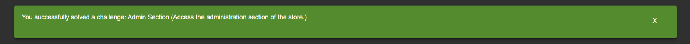

# Report di OSWAP Juice shop

### Intoduzione
In questa demo ho scelto di utilizzare OSWAP Juice shop come target per sperimentare Burp e altri tool. Inizialmente, ho provato a ottenere le flag autonomamente (basandomi sulla [lista delle vulnerabilità](https://pwning.owasp-juice.shop/companion-guide/latest/part2/README.html) o provando a mettere in pratica alcune nozioni del sito del corso) e, in caso di difficoltà, consultando il corrispondente aiuto della medesima pagina. Premetto che:
* Sia la demo che il report sono suddivise per flag ottenuta; 
* L'ordine delle flag nella demo rispetta l'ordine delle flag nel report;
* L'ordine delle flag non è l'ordine con cui ho effettivamente conquistato la flag;
* Gli strumenti che ho utilizzato, sia per la scrittura del report che la costruzione della demo, sono riportati alla fine della pagina;
* La demo presenta alcuni tagli improvvisi sui video originali. Questo è dovuto al fatto che la demo mostra esclusivamente la soluzione corretta, trovata alla fine di numerose prove senza successo ma comunque presenti nei video originali;

## Flag ottenute senza aiuti:

### Login as admin  
**Descrizione**: Log in with the administrator’s user account.  
**Soluzione**: Questa flag l'ho ottenuta cercando di effettuare un bypass del login tramite una SQL injection. Non avendo ancora trovato nè uno username nè una password per effettuare un login legittimo, ho provato una SQL injection sul campo username della pagina e ho ottenuto l'accesso come admin.  
  

---

 ### Error handling
**Descrizione**: Provoke an error that is neither very gracefully nor consistently handled.   
**Soluzione**: Sbagliando nel immettere una corretta stringa per effettuare l'SQL injection, ho ottenuto questo flag accidentalmente.  
  

---

 ### Zero-stars 
**Descrizione**: Give a devastating zero-star feedback to the store.  
**Soluzione**: Provando ad analizzare le richieste http per fare un normale feedback, mi sono accorta che la valutazione in stelle faceva parte del json portato in payload. Questa valutazione prende valore di un numero intero. Modificando questo valore, è stato possibile lasciare un feedback di zero stelle.  
  

---
  
 ### Forged feedback
**Descrizione**: Post some feedback in another user’s name.  
**Soluzione**: Osservando ancora la richiesta http effettuata dal client per mandare un feedback di un utente, ho notato la presenza dell'attributo "UserId" all'interno del json del payload. Questo campo contiene un numero che identifica uno user. Sostituendo tale numero con l'id di un altro user, si ottiene lo stesso feedback ma con l'autore diverso dallo user originario.  
  

---

 ### CAPTCHA bypass
**Descrizione**: Submit 10 or more customer feedbacks within 10 seconds.  
**Soluzione**: Provando ad analizzare le richieste http per fare un normale feedback, mi sono accorta che il CAPTCHA era identificato da un id nel json del payload. Ho supposto, allora, che il risultato del CAPTCHA fosse controllato mediante il suo id. Copiando questo id e il risultato corretto del CAPTCHA in un altro pacchetto, è stato possibile replicare lo stesso pacchetto, usando repeater di burp, e spedirlo più volte al server in pochi secondi.  
  

---

 ### Forged review
**Descrizione**: Post a product review as another user or edit any user’s existing review.  
**Soluzione**: Provando ad analizzare le richieste http per fare una normale review con un utente, mi sono accorta che lo username della review veniva trasportato tramite coppia nome-valore nel json del payload, facilmente modificabile attribuendogli un altro username. In questo modo, la review salvata nel sito conteneva il massaggio che avevo inserito ma l'autore corrispondeva allo username inserito nel json. 
   

---

 ### Login Bender
**Descrizione**: Log in with Bender's user account.  
**Soluzione**: Ricavando lo username di Bender da una review su un prodotto, l'ho inserito nel campo usernaname nella pagina di login per effettuare l'accesso con il suo account. Non conoscendone la password e tantomeno il token contenente le sue credenziali, ho effettuato un'altra SQL injection per aggirare il controllo della password.  
  

---
  
    
## Flag ottenute usando il suggerimento corrispondente:

 ### Bully chatbot
**Descrizione**: Receive a coupon code from the support chatbot.  
**Soluzione**: Grazie al [suggerimento](https://pwning.owasp-juice.shop/companion-guide/latest/part2/miscellaneous.html#_receive_a_coupon_code_from_the_support_chatbot) sono riuscita a ottenere il coupon da chatbot, semplicemente continuando ad insistere.  
  

---

 ### Password strenght
**Descrizione**: Log in with the administrator’s user credentials without previously changing them or applying SQL Injection.  
**Soluzione**: Avendo letto il sito del corso, sapevo che all'interno dell'authorization token era contenuto l'hash della password di quell'utente. Ho utilizzato questa informazione sul token dell'admin in quanto avevo appena conseguito la flag "login admin". Ho intercettato con burp la richiesta http generata cliccando sul carrello e ho copiato il token. Utilizzando [questo sito](https://jwt.io/) per decifrare il token e [questo sito](https://crackstation.net/) per l'offline guessing, sono riuscita a ricavare la password dell'admin in chiaro ed effettuare un login legittimo utilizzando le sue credenziali.  
> *Nella descrizione della flag viene specificato di non usare prima la SQL injection, ma ho ottenuto lo stesso questo flag. Non era mia intenzione ottenerlo, nè tantomeno stavo cercando di ottenerlo. Volevo semplicemente applicare le informazioni lette sul sito del corso.*  
  

---

### Admin registration
**Descrizione**: Register as a user with administrator privileges.  
**Soluzione**: Dopo diversi tentativi, ho consultato l'[aiuto](https://pwning.owasp-juice.shop/companion-guide/latest/part2/improper-input-validation.html#_register_as_a_user_with_administrator_privileges) che suggeriva il "metodo più semplice". Provandoci ancora un paio di volte e studiando la struttura json dei token (utilizzando sempre [questo sito](https://jwt.io/)), ho notato un campo chiamato "role". Questo campo prende valore "admin" nell'account admin e "customer" negli altri account. Intercettando la richiesta di registrazione e inserendo questo campo nel json del payload assegnandogli valore "admin", ho ottenuto finalmente la flag.  
  

---

### Admin section
**Descrizione**: Access the administration section of the store.  
**Soluzione**: Sfruttando il primo [suggerimento](https://pwning.owasp-juice.shop/companion-guide/latest/part2/broken-access-control.html#_access_the_administration_section_of_the_store) molto banale, ho provato a indovinare il path corretto. Dopo un paio di tentativi l'ho indovinato e sono arrivata alla sezione di amministrazione, ottenendo la flag.  
  

---
---

### Strumenti utilizzati:
* **[Burp](https://portswigger.net/burp)**: tool per intercettare le richieste http effettuate, studiarne il cotenuto, modificarlo e replicarlo. Ho utilizzato la community edition, con le sue utilissime funzionalità di repeater, per studiare il comportamento sel server, e le funzionalità di intruder, per mandare diverse richieste automaticamente cambiano certi parametri personalizzati;
* **[jwt.io](https://jwt.io/)**: sito con un tool online per la decodifica di JSON web tokens. L'ho utilizzato per decifrare i token che il client e il server si scambiavano, analizzarne il contenuto e sfruttarlo per ottenere alcune flag;
* **[crackstatio.net](https://crackstation.net/)**: tool online per il password cracking. L'ho utilizzato per ricavare la password in chiaro dell'amministratore passandogli il suo hash corrispondente;
* **[OBS](https://obsproject.com/)**: tool per video recording e streaming. L'ho utilizzato per registrare i video per la demo mentre ottenevo le flag;
* **[ClipChamp](https://clipchamp.com/en/)**: tool per l'editing e composizione dei video. L'ho utilizzato per ritagliare e unire insieme tutti i video che ho mantenuto sulle flag, in modo da comporre la demo finale;
* **[Visual studio code](https://code.visualstudio.com/)**: tool per l'editing di codice sorgente. L'ho utilizzato per scrivere il report e gestire la repository di github;

